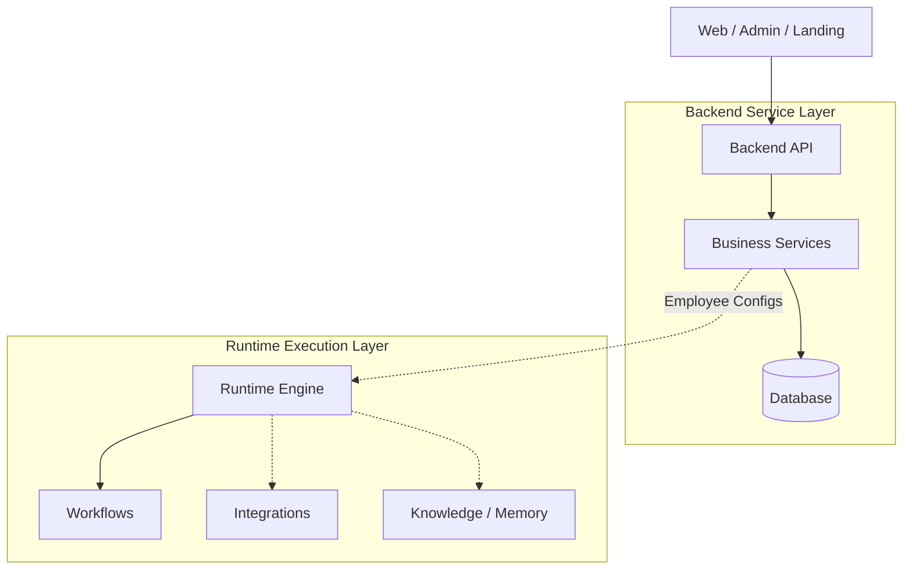

# AI Workforce Architecture

## Overview
AI Workforce is an enterprise SaaS platform that separates business logic from runtime agentic execution. It enforces multi-tenancy at all layers.

## High-Level Architecture

## Architectural Principles

1. **Separation of Concerns:** Business logic lives in `backend`, while execution logic lives in `runtime`.
2. **No Direct DB Access in Runtime:** `runtime` consumes configurations (prompts, tools, rules) generated by `backend/services`. It never queries the database.
3. **Employees as Configurations:** Employees are not hardcoded logic. They are dynamic configurations orchestrated by the workflow engine.
4. **Shared Platform Services:** Integrations (Gmail, Slack) and Knowledge (Vector Store, Chunking) act as reusable capabilities for the runtime.
5. **Multi-Tenancy:** Enforced across the entire stack via the database models and service layer contexts.

## Directory Structure
- `apps/`: Frontend applications.
- `backend/`: Business logic, API routes, and configuration generation.
- `database/`: Database models, schemas, and repositories.
- `runtime/`: Execution engine, planning, workflows, and tool execution.
- `integrations/`: Shared external system integration clients.
- `knowledge/`: Shared RAG and document processing services.
